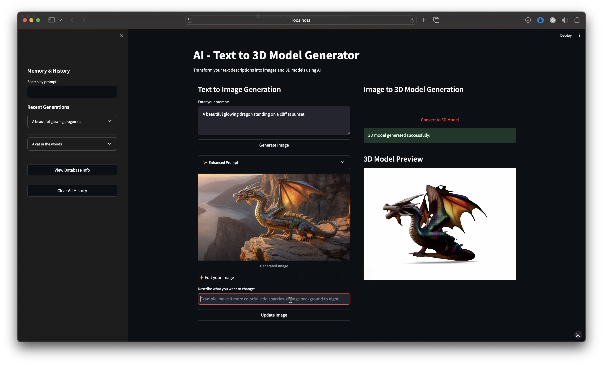

# AI-Powered Text to 3D Model Converter

Generate high-quality images and 3D models from simple text descriptions using AI. This project integrates a local language model via Ollama and utilizes Openfabric’s AI services for image and model generation.

---

##  Setup & Installation

###  Prerequisites

1. **Install Ollama & Pull Model**
   > Visit [https://ollama.ai](https://ollama.ai) to install Ollama, then pull the latest LLaMA model:

   ```bash
   ollama pull llama3:latest

2. **Start Ollama Service**

   ```bash
   ollama serve
   ```

3. **Configure Python Environment**

   ```bash
   # Set up a virtual environment
   python -m venv venv

   # Activate environment
   # macOS/Linux:
   source venv/bin/activate
   # Windows:
   venv\Scripts\activate

   # Install dependencies
   pip install -r requirements.txt
   pip uninstall -y python-magic
   pip install python-magic-bin==0.4.14
   ```

4. **Launch the App**

   ```bash
   streamlit run app/gui.py
   ```

---

##  Key Features

###  Text to Image

* AI-augmented prompt enhancements
* High-resolution image output
* Style-aware adjustments

###  Image to 3D Model

* Converts 2D images into 3D meshes
* Real-time previews

###  Integrated Memory System

* Short-term memory per session
* Persistent storage using SQLite
* Search, track, and revisit prior generations

###  User-Friendly Interface

* Built with Streamlit
* Interactive sidebar with history access
* Live updates and visual previews

---

##  Technologies Used

* **Openfabric SDK** for image and 3D generation
* **Ollama (llama3\:latest)** as the local language model
* **SQLite** for local data persistence
* **Streamlit** for web UI

---

##  Project Structure

```
app/
├── config/                  # App configuration
├── core/                   # Core logic and interfaces
│   ├── __init__.py
│   ├── remote.py
│   └── stub.py
├── managers/               # Functional modules
│   ├── llm_manager.py
│   ├── memory_manager.py
│   └── openfabric_manager.py
├── utils/
│   └── utils.py
├── gui.py                  # Streamlit interface
└── main.py
```

---

##  Core Modules Overview

* **LLM Manager**
  Communicates with Ollama, improves prompt quality, and manages context.

* **Openfabric Manager**
  Connects with Openfabric's APIs to handle image and 3D generation.

* **Memory Manager**
  Manages generation history and file storage using SQLite.

---

##  Database Schema

Stored using SQLite:

| Column            | Description                          |
| ----------------- | ------------------------------------ |
| `id`              | Unique identifier                    |
| `prompt`          | Original user-entered prompt         |
| `enhanced_prompt` | AI-refined version of the prompt     |
| `image_path`      | Location of the generated image      |
| `model_path`      | Path to the 3D model file            |
| `created_at`      | Timestamp of creation                |
| `metadata`        | JSON-formatted details (tags, edits) |

---

##  How to Use

1. Enter a description of the image you want to create.
2. The system generates an image based on an AI-enhanced prompt.
3. Convert the generated image into a 3D model.
4. Use the sidebar to access past generations and search through them.
'Create a glowing dragon standing on a cliff at sunset'

---

##  Interface Snapshot



---

##  Troubleshooting

###  ImportError: `has_resource_fields` from `openfabric_pysdk.helper`

This error often happens if you're using the wrong Python environment (e.g., Anaconda). Follow these steps:

```bash
# Deactivate any active environment
deactivate
conda deactivate

# Create a new virtual environment
python -m venv venv

# Activate it
# macOS/Linux:
source venv/bin/activate
# Windows:
venv\Scripts\activate

# Reinstall dependencies
pip install -r requirements.txt
```

Use `which python` (or `where python` on Windows) to ensure you are using the virtual environment’s Python binary.

---

##  License

This project is provided under an open-source license. Refer to the `LICENSE` file for more details.

